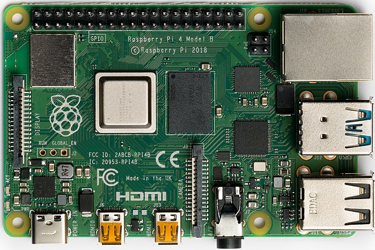

Raspberry Pi 4
==============

Introduction
------------

The Rasberry Pi 4 board is based on the BCM2711 System on a chip. It features
a 1.5 GHz 64-bit quad core ARM Cortex-A72 processor, and 1-8 gigabytes of ram
depending on the model. 
There are currently two Models being produced, The model B (shown above), and
the mode 400, which is built into a keyboard case.

Availible Drivers
-----------------

* [16550 Compatible UART](../../../drivers/console/16550_uart/) 
    - This is available via the GPIO header's UART0 on pins 8 and 10

